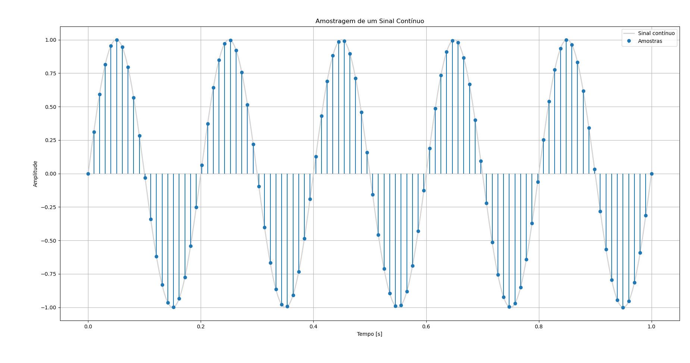
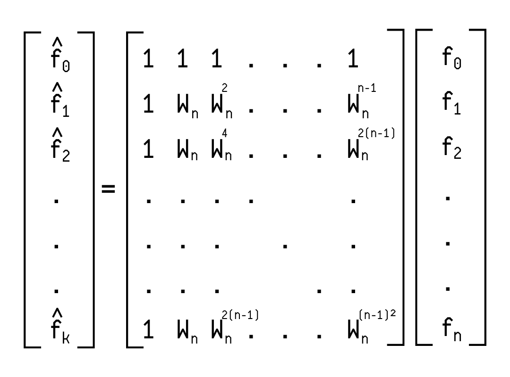
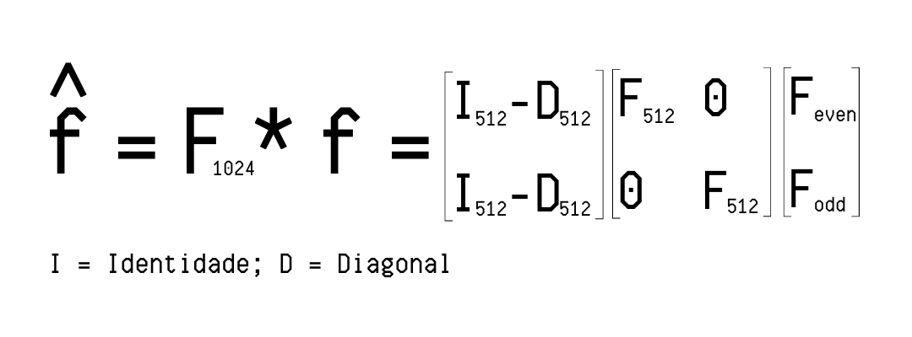

# 🎧 Supressão de Ruídos com FFT

A **Transformada Rápida de Fourier (FFT)** é uma das ferramentas mais importantes e poderosas desenvolvidas para o **processamento de sinais**, com amplo impacto em diversas áreas. Ela consiste em um algoritmo capaz de calcular de forma rápida e eficiente a **Transformada Discreta de Fourier (DFT)**.

Uma de suas aplicações mais interessantes é a **supressão de ruídos**, que visa remover frequências indesejadas de um sinal para recuperar sua forma original. Essa técnica pode ser utilizada em sinais de áudio, imagens ou dados em geral.

Este repositório apresenta um exemplo prático de como utilizar a FFT para filtrar um sinal contaminado por ruído.

---

## 📚 Índice

- [🔍 Entendendo a DFT e a FFT](#-entendendo-a-dft-e-a-fft)
- [🧠 O Algoritmo](#-o-algoritmo)
- [📊 Resultados](#-visualizações)
- [🛠️ Requisitos](#️-requisitos)

---

## 🔍 Entendendo a DFT e a FFT

A **Transformada de Fourier** permite transformar sinais do **domínio do tempo** para o **domínio da frequência**. No entanto, quando trabalhamos computacionalmente, lidamos com **sinais discretos** — ou seja, um conjunto de amostras de um sinal contínuo, obtidas em um intervalo de tempo.

<p align="center">
  
</p>

Para processar essas amostras, utilizamos a **Transformada Discreta de Fourier (DFT)**. Ela transforma um vetor de amostras $\( f[n] \)$ em um vetor de coeficientes de Fourier $\( \hat{f}[k] \)$, por meio da seguinte fórmula:

<h1>
      $X[k] = Σ_{n=0}^{N-1} x[n] * e^{-j2πkn/N}$ 
</h1>

Essa fórmula utiliza a constante $\( W_n = e^{-i2\pi/n} \)$, onde $\( i = \sqrt{-1} \)$. Substituindo essa constante, podemos expressar a DFT como uma **multiplicação de matrizes**:

<p align="center">
  
</p>

Embora funcional, esse método tem complexidade **O(n²)**, pois exige $\( n \times n \)$ multiplicações — o que se torna inviável para sinais grandes.

Para resolver esse problema, foi desenvolvida a **FFT**, que otimiza a DFT reorganizando as operações em um conjunto de matrizes menores:

<p align="center">
  
</p>

Por exemplo, um vetor de 1024 amostras pode ser dividido em dois de 512, e assim por diante, até chegar em vetores de tamanho 2. Essa divisão reduz drasticamente a quantidade de operações, resultando em uma complexidade de **O(n log n)**.

A FFT é especialmente eficiente quando o número de amostras $\( n \)$ é uma potência de 2. Por isso, é comum que algoritmos completem os dados com zeros ("zero-padding") para atender essa condição.

---

## 🧠 O Algoritmo

Entendido o conceito da FFT, vejamos como ela é aplicada neste projeto. O código em Python parte de um **sinal com ruído**, aplica a FFT para identificar as frequências dominantes e suprimir as demais, "limpando" o sinal.

### Etapas do Algoritmo:

1. **Criação do sinal original**  
   - Definido como a soma de senóides com frequências conhecidas (ex: 50 Hz e 120 Hz).

2. **Adição de ruído branco**  
   - O sinal é corrompido com ruído aleatório.

3. **Aplicação da FFT**  
   - O sinal é transformado para o domínio da frequência.

4. **Cálculo do Power Spectral Density (PSD)**  
   - A potência de cada frequência é avaliada.

5. **Identificação das frequências relevantes**  
   - As componentes com maior magnitude correspondem ao sinal original. As demais são ruído.

6. **Filtragem**  
   - Frequências irrelevantes são eliminadas (valores zerados).

7. **Transformada Inversa (IFFT)**  
   - O sinal é reconstruído no domínio do tempo, agora sem ruído.

---

## 📊 Resultados

Durante a execução, os seguintes gráficos são gerados automaticamente:

- 🎵 **Sinal original** (`clean`)
- 🌪️ **Sinal com ruído** (`noisy`)
- 📉 **Espectro de Frequência (PSD)**
- 🧼 **Sinal filtrado** (`filtered`)

Essas visualizações tornam o processo de supressão de ruído mais intuitivo e facilitam a comparação entre os sinais.

---

## 🛠️ Requisitos

- Python 3.x
- Bibliotecas:
  - `numpy`
  - `matplotlib`

Para instalar as dependências, utilize:

```bash
pip install numpy matplotlib
